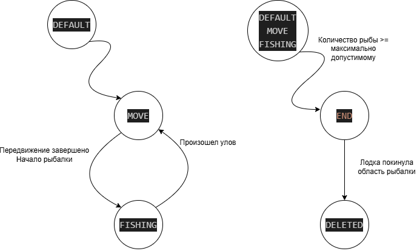
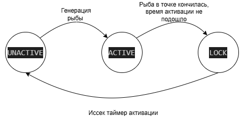
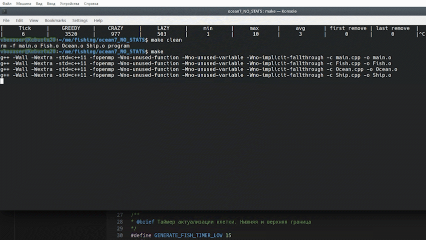

# Симуляция рыбалки

## 📋 Описание
Разработать программу, моделирующую следующую симуляцию:
Есть квадратное море, размером 100 000 х 100 000 клеток;
В море водится рыба;
По морю плавают лодки (100 000 штук) и ловят рыбу;
Все действия в симуляции происходят по тикам;
Лодка заранее не знает, есть ли рыба в клетке моря, поэтому подплывает к клетке и забрасывает сеть, через 1 – 3 тика сеть вынимается, улов содержит 1 – 10 рыб.


## 🔄 Конечный автомат лодок
Визуальное представление логики работы лодки:



*Рисунок 1: Диаграмма состояний системы*

## 🔄 Конечный автомат клеток
Визуальное представление логики работы клетки:



*Рисунок 1: Диаграмма состояний системы*

## 🎬 Результаты работы
Анимация, демонстрирующая работу проекта в действии (максимальное количество пойманной рыбы для удаления 20, поэтому first_remove сразу фиксируется. В случае 10000 первое удаление произойдет ~8800-9000 тике, из-за времени генерации и количества сгенерированной рыбы):



*GIF 1: Пример использования основных функций*

## 📊 Дополнительный проект
Для более детального анализа и визуализации доступен дополнительный подпроект:
Ссылка:
### 🔗 [Проект визуализации и статистики](https://github.com/KudryavtsevW/Ocean_visual.git)

**В этом подпроекте представлены:**
- 📈 Визуализация процесса и подробное логгирование

### Предварительные требования
- с++11
- openmp
- make

### Старт
```bash
#Установка make
sudo apt-get install make
# Клонирование репозитория
git clone https://github.com/KudryavtsevW/Ocean.git
cd Ocean
make
./program
